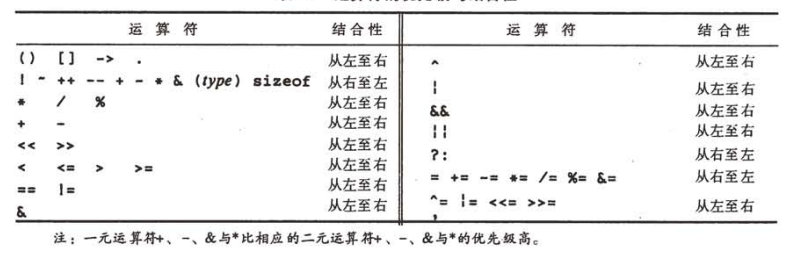

title: C 语法
description: C 语法
categories:
  - 计算机基础
author: Jade
date: 2021-11-24 13:00:00
---

## 数据类型、运算符、表达式
### 变量名
数字及字母组成，以字母开头。
“_”被看作是字母，用来命名较长的变量名。
库例程的名字通常以下划线开头，因此变量不要以下划线开头。
严格区分大小写。
关键字不能用作变量，关键字中的字符小写。

### 数据类型
基本数据类型
|-|-|-|
|数据类型|名称|长度|
|char|字符型|一个字节|
|int|整型|所用机器中整数的最自然长度|
|float|单精度浮点型|-|
|double|双精度浮点型|-|

类型限定符
short/long 限定整型： short通常为16位，long通常为32位。
signed/unsigned 限定char类型或任何整型。不带限定符的对象是否带符号取决于具体机器实现。
long double ： 表示高精度的浮点数。浮点型的长度取决于具体的实现。
### 常量
定义： #define 常量名 常量值
常量类型通过后缀可以判断。无符号常量以u/U结尾。

枚举是一个常量整型值的列表。
定义： enum 枚举名 { 常量名[=值]... }
没有显示指定，第一个值为0，显示指定部分值，按最后一个指定值递增。

define VS enum
enum常量值可以自动生成。

调试程序可以以符号形式打印出枚举变量的值。

### 声明
所有变量必须先声明后使用。
初始化表达式 变量名的后面紧跟一个等号以及一个表达式。
默认情况下，外部变量与静态变量将被初始化为0。未经显示初始化的自动变量的值为未定义值。

限定符
const 指定变量的值不能被修改。数组中所有元素的值都不能被修改。

### 运算符
- 算术 + - * / %
- 关系 > >= < <=
- 相等性 == !=
- 逻辑 && || （短路功能） ！
- 自增/自减 ++ --
- 按位 & | ! ^ << >> ~ （只能作用与整型）（算术移位/逻辑移位）
- 赋值 =
- 三元 ?:

- 逗号 ,

优先级 关系 > 相等性 > 逻辑 （&& > ||）
？？？


### 类型转换
算术类型转换 运算时两个操作数类型不同，进行运算钱把“较低”的类型提升为“较高”的类型。（float不会自动转换为double）
赋值类型转换 超出的高位部分将被丢弃。
强制类型转换 显示类型转换 （类型名）表达式

char类型是较小的整型，因此在算术表达式中可以自由使用char类型的变量。

### 表达式
？？？

## 控制流
语句： 表达式后加上一个分号（；）。分号是语句结束符。
程序块： 复合语句，把一组声明和语句用一对花括号（{}）括在一起。

- if-else 用于条件判定。
- else-if 用于多路判定。
- switch 多路判定语句，使用常量表达式。
- while 循环体执行前对终止条件进行测试。
- for 循环体执行前对终止条件进行测试；包含continue时可以和while转换。（包含简单的初始化和变量递增时更合适）
- do-while 循环体执行后对终止条件进行测试，循环体被至少执行一次。
- break 从switch中跳出，或在for、while、do-while最内层跳出。
- continue 使for、while、do-while开始下一次的循环。
- goto 跳到标号处执行。适合深度嵌套的处理过程。尽可能少的使用。

## 函数
定义
```
返回值类型 函数名(参数声明表) {
    声明和语句
}

```
如果函数定义中省略了返回值类型，则默认为int类型。

## 指针和地址运算

## 结构、联合

## 标准库

